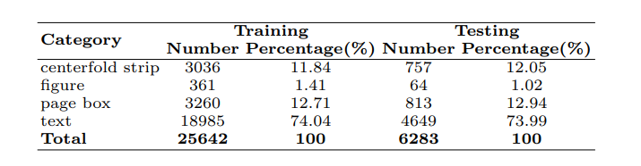
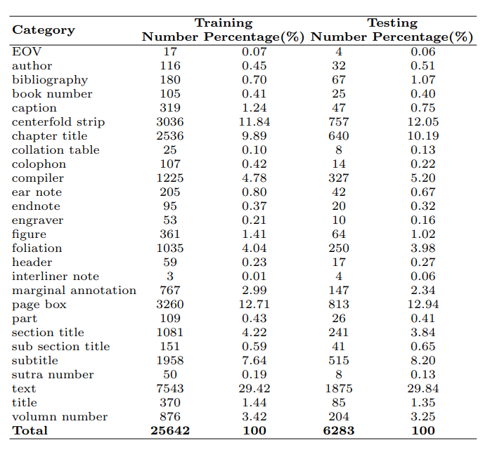

# SCUT-CAB_Dataset_Release
The SCUT-CAB dataset for the research of document layout analysis in Chinese ancient books is now released by the Deep Leaning and Visual Computing Lab of South China University of Technology. The dataset can be downloaded through the following link:
- [Baidu Cloud](https://pan.baidu.com/s/1U7WY9FaWz0BacB2RAMg4bQ)(Password: dlvc, Size=6.84G)
- [OneDrive]() 

Note: The SCUT-CAB dataset can only be used for non-commercial research purposes. For scholars or organizations who want to use the SCUT-CAB database, please first fill in this [Application Form](Application_Form/Application-Form-for-Using-SCUT-CAB.docx) and send it via email to us ([eelwjin@scut.edu.cn](mailto:eelwjin@scut.edu.cn), or [lianwen.jin@gmail.com](mailto:lianwen.jin@gmail.com)). When submitting the application form to us, please list or attach 1-2 of your publications in the last 6 years to indicate that you (or your team) do research in the related research fields of OCR, handwriting analysis and recognition, document image processing, and visual information extraction. At present, this dataset is only freely available to scholars in the above-mentioned fields. We will give you the decompression password after your letter has been received and approved.

## License
The SCUT-CAB dataset should be used and distributed under the [Creative Attribution-NonCommercial-NoDerivatives 4.0 International (CC BY-NC-ND 4.0) License](https://creativecommons.org/licenses/by-nc-nd/4.0/) for non-commercial research purposes.

## Description
The SCUT-CAB Dataset is established by manually annotating 4000 images of ancient books, including 31,925 layout element annotations, which contain different binding forms, fonts, and preservation conditions. To facilitate the multiple tasks involved in document layout analysis, the dataset is segregated into two subsets: SCUT-CAB-Physical for physical layout analysis and SCUT-CAB-Logical for logical layout analysis. SCUT-CAB-Physical contains four categories, whereas SCUT-CAB-Logical contains 27 categories. Furthermore, the SCUT-CAB dataset comprises the labeling of the reading order.

## Examples of SCUT-CAB
### Data source:

We have collected ancient books of different content, including:
+ Buddhist scriptures, mainly the Tripitaka, which is broad in content. They contain not only Buddhist teachings, but also discussions on politics, ethics, philosophy, literature, art, and customs. 
+ Reproductions of the Chinese Rare Editions Series, which covers the essence of Chinese cultural classics to the greatest extent. It has high documentary value, academic research value, and preservation value. All the books in this series are in the form of photocopies. According to the original book layout, they are photographed, printed, and collected, and they are carefully crafted. 
+ Local chronicles, one of the essential sources for studying Chinese history over the past thousand years. They contain copious materials on local administration, local economies, local cultures, local dialects, local officials, and local dignitaries.

### Multiple layouts
+ Warp-fold binding: It began in the late Tang Dynasty. It is a kind of improvement of the scroll packaging by the ancient Chinese Buddhist followers who learned the advantages of the traditional Indian binding method. They folded the Buddhist scriptures evenly left and right according to a certain number of rows and widths, as shown in Fig. 1(a). 
+ Wrapped-back binding: It began in the mid-to-late Southern Song Dynasty, with the pages folded back-to-back so that the side with the text is facing outward, as shown in Fig. 1(b). 
+ Photocopies: It refers to books printed with modern photographic technology. Most of them are wrapped-back binding and stitched binding. The structure of stitched binding and wrapped-back binding is roughly the same, as shown in Fig. 1(c). 
+ Butterfly binding: It is a product of engraving and printing technology in the Northern Song Dynasty. It folds the pages in half according to the center seam. The side with the printed text faces inward, as shown in Fig. 1(e). 
+ Other layouts: Due to differences between ancient books in different periods, there are some special layouts. (1) The Buddhist Sutras contain a layout element "header," as shown in Fig. 1(d). (2) the butterfly bindings that contain a layout element called "marginal note" (notes taken by ancient people while reading books), as shown in Fig. 1(f). (3) The butterfly binding that contains the category of "book ears" (which are at the top of the left column of the page box, and sometimes a tiny square appears, mainly found in the butterfly binding layout of the Song Dynasty), as shown in Fig. 1(g).


Fig. 1. Multiple layouts of SCUT-CAB. (a) Warp-fold binding. (b) Wrapped-back binding. (c) Photocopies. (d) Layout with the header. (e) Butterfly binding. (f) Layout with the marginal note. (g) Layout with the ear note.

### Multiple image quality
Ancient books have faded and corroded due to degradation from centuries of use. Therefore, in addition to the contents and layout diversity, we have taken into account multiple image qualities of the ancient books when constructing the dataset, including pages damaged(Fig. 2, a), ink fading(Fig. 2, b), and backthrough(Fig. 2, c). Due to the rapid improvement of printing techniques, modern photocopying technology has already surpassed the original lithography technology in terms of version identification and reproduction effect. This also makes the Reproductions of the Chinese Rare Editions Series have more exquisite quality assurance, as shown in Fig. 2(d). The local chronicle datasets are mostly scanned black and white pictures, and there are many damaged and unclear handwriting, as shown in Fig. 2(e).


Fig. 2. Multiple image quality of SCUT-CAB. (a) Pages damaged. (b) Ink fading. (c) Back-through. (d) Exquisite. (e) Damages and unclear.

## SCUT-CAB-Logical and SCUT-CAB-Physical Subsets

+ SCUT-CAB-Logical: To better understand the meaning of different regions of ancient books, we define the categories of logical analysis data based on the basic knowledge of ancient books and the "Introduction to the Collation of Ancient Books." In this work, the following logical categories are annotated in SCUT-CAB: {EOV (end of the volume), author, bibliography, book number, caption, centerfold strip, chapter title, collation table, colophon, compiler, ear note, endnote, engraver, figure, foliation, header, interlinear note, marginal annotation, page box, part, section title, sub section title, subtitle, sutra number, text, title, volume number}. It contains 31,925 layout elements annotated in 27 categories. A sample of all categories is given in Fig. 3. 
+ SCUT-CAB-Physical: Physical analysis tasks do not need to classify as in detail as logical analysis tasks, so we modify the categories in SCUT-CAB-Logical. There are 4 categories: {centerfold strip, figure, page box, and text}.


Fig. 3. Examples of SCUT-CAB images and annotations. 27 categories of layout elements are highlighted in different colors.


### Reading order
SCUT-CAB includes reading-order annotations. As shown in Fig. 4, the correct reading order is from top to bottom and left to right. We focused only on the reading order of the body text, and the labels outside were ignored, such as the volume number of sutra and centerfold strips in pages, as shown in Fig. 4(a) and 4(b). For photocopies, we filtered out labels that were extremely small, which could disrupt the reading order, as shown in Fig. 4(c).


## Statistics of SCUT-CAB
Table 1 and Table 2 provide the statistics of the training and testing sets in the SCUT-CAB-Physical and SCUT-CAB-Logical, respectively, where numbers and percentages of each category are presented.

Table 1. Statistics of training and testing sets in SCUT-CAB-Physical.


Table 2. Statistics of training and testing sets in SCUT-CAB-Logical.


## Directory Format
The dataset is organized in the following directory format:
```
├── SCUT_CAB
    ├── images
    │   ├── train
    │   │   ├── xxx.jpg
    │   │   └── ...
    │   └── test
    │       ├── xxx.jpg
    │       └── ...
    ├── SCUT_CAB_logical
    │   ├── labels_logical.txt
    │   ├── annotations
    │   │   ├── instances_train.json
    │   │   └── instances_test.json
    │   └── josn
    │       ├── xxx.json
    │       └── ...
    └── SCUT_CAB_physical
        ├── labels_physical.txt
        ├── annotations
        │   ├── instances_train.json
        │   └── instances_test.json
        └── json
            ├── xxx.json
            └── ...

```

## Citation and Contact
Please consider to cite our paper when you use our dataset:
```
@article{cheng2022scut,
  title={SCUT-CAB: A New Benchmark Dataset of Ancient Chinese Books with Complex Layouts for Document Layout Analysis},
  author={Hiuyi Cheng, Cheng Jian, Sihang Wu, Lianwen Jin},
}
```

For any questions about the dataset, please contact the authors by sending an email to Prof. Jin([eelwjin@scut.edu.cn](mailto:eelwjin@scut.edu.cn), or [lianwen.jin@gmail.com](mailto:lianwen.jin@gmail.com)). 
