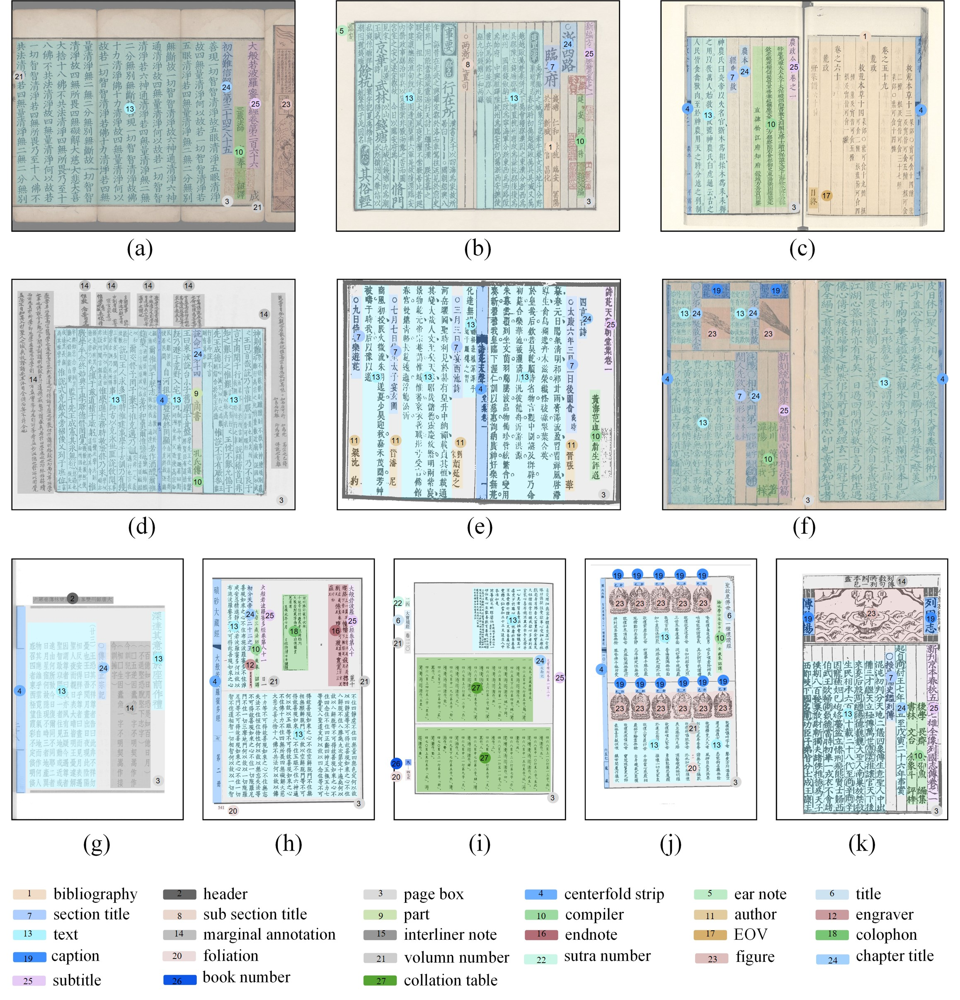

# SCUT-CAB_Dataset_Release
The SCUT-CAB Dataset for the research of document layout analysis in Chinese ancient books is now released by Deep Leaning and Visual Computing Lab of South China University of Technology. The dataset can be downloaded through the following link:

- [Baidu Cloud](https://pan.baidu.com/s/1xxgt3olnC3nh4-nf7K9Nvg)(Password: dlvc)
- [OneDrive](https://1drv.ms/u/s!AkXauEAZ68NKoQoaUccK7MjVetNq?e=RcQD8t) 


Note: The SCUT-CAB dataset can only be used for non-commercial research purpose. For scholars or organization who wants to use the SCUT-CAB database, please first fill in this [Application Form](Application_Form/Application_Form_for_Using_SCUT-CAB_2022.doc) and send it via email to us ([eelwjin@scut.edu.cn](mailto:eelwjin@scut.edu.cn)). When submiting the application form to us, please list or attached 1-2 of your publications in recent 6 years to indicate that you (or your team) do research in the related research fields of OCR, handwriting analysis and recognition, document image processing, and so on. We will give you the decompression password after your letter has been received and approved. 

## Copyright section
License
SCUT-CAB dataset should be used and distributed under Creative Attribution-NonCommercial-NoDerivatives 4.0 International (CC BY-NC-ND 4.0) License for non-commercial research purposes.

## Description
<!-- The SCUT-CAB Dataset contains 4000  images of Chinese ancient books, including 31,931 layout element annotations, which contains different binding forms, fonts, and preservation conditions. To facilitate multiple tasks of layout analysis, the dataset is divided into two parts: CAB-Physical for physical layout analysis and CAB-Logical for logical layout analysis.  CAB-Physical contains 4 classes including 31,931 layout elements annotations, CAB-Logical contains 27 classes including 31,931 layout elements annotations. The SCUT-CAB dataset also contains the labeling of the reading order. -->
The SCUT-CAB Dataset is established by manually annotating 4000 images of ancient books, including 31,931 layout element annotations, which contains different binding forms, fonts, and preservation conditions. To facilitate the multiple tasks involved in document layout analysis, the dataset is segregated into two subsets: SCUT-CAB-Physical for physical layout analysis and SCUT-CAB-Logical for logical layout analysis. SCUT-CABPhysical contains four categories, whereas SCUT-CAB-Logical contains 27 categories. Furthermore, the SCUT-CAB dataset comprises the labeling of the reading order.

## Examples of SCUT-CAB
<!-- Data source:
  + Buddhist scriptures. The dataset of MTHv2 contains Buddhist scripture datasets of various layouts, which are suitable for layout analysis tasks. Bud-
dhist scriptures are rich in content, including political, ethical, philosophical, literature, art, customs etc.
+ Chinese Remade Rare Book. Rare books are the essence of ancient book culture. Selected and representative precious classics in the history of books
and editions.
+ Others. Includes a variety of ancient books including local county histories and poetry scriptures. -->
Data source:
  We have collected ancient books of different content, including:
+ Buddhist scriptures, mainly the Tripitaka, which is broad in content. They contain not only Buddhist teachings, but also discussions on politics, ethics, philosophy, literature, art, and customs. 
+ Reproductions of Chinese Rare Editions Series, which covers the essence of Chinese cultural classics to the greatest extent. It has a high documentary value, academic research value and preservation value. All the books in this series are in the form of photocopying, According to the original book layout, they are photographed, printed, and collected, and they are carefully crafted. 
+ Local chronicles, one of the essential sources for studying Chinese history over the past thousand years. They contain copious materials on local administration, local economies, local cultures, local dialects, local officials, and local dignitaries.



Examples of reading order：


## Statistics of SCUT-CAB

The following pysical semantic appearance are annotated in CAB-Pysical:(centerfold strip, figure, page box,
text) with four categories.


The following logical semantic structures are annotated in CAB-Logical: (EOV, author, bibliography, book number,
caption,centerfold strip, chapter title, collation table,colophon, compiler, ear note, endnote,
engraver,figure, foliation, header, interliner note,marginal annotation, page
box, part, section title,sub section title, subtitle, sutra number, text,title,
volumn number) with 27 classes.


## Citation and Contact
Please consider to cite our paper when you use our dataset:
```
@article{cheng2022scut,
  title={SCUT-CAB: A New Benchmark Dataset of Ancient Chinese Books with Complex Layouts for Document Layout Analysis},
  author={Hiuyi Cheng, Cheng Jian, Sihang Wu, Lianwen Jin},
}
```
For any quetions about the dataset please contact the authors by sending email to Prof. Jin
([eelwjin@scut.edu.cn](mailto:eelwjin@scut.edu.cn)), Hiuyi Cheng
([eechenghiuyi@mail.scut.edu.cn](mailto:eechenghiuyi@mail.scut.edu.cn)) or Cheng Jian 
([eechengjian@mail.scut.edu.cn](mailto:eechengjian@mail.scut.edu.cn)).

